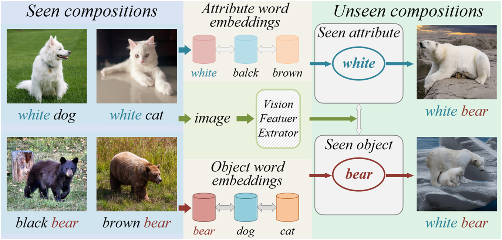

# AOGN
Code for an Attributes and Objects  Guided Network for Compositional Zero-Shot Learning

**AOGN-CZSL: an Attributes and Objects Guided Network for Compositional Zero-Shot Learning，IEEE Transactions on Neural Networks and Learning Systems**

**Jing Yang**, **Xingjiang Ma**, **Yuankai Wu**, **Chengjiang Li**, **Zhidong Su**, **Ji Xu**, **Yixiong Feng**

  

**Full code will be uploaded after the paper is accepted.**
